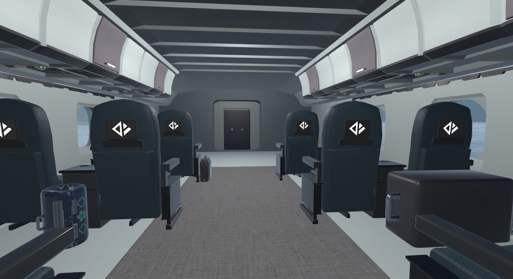

# PlaneCrashSimulator

## ПО необходимое для работы с проектом:

|Name         |Version   |
|-------------|----------|
|Unity        |2019.4.1f1|
|Visual Studio|2019      |

## ⌨ Управление 
| Кнопка        | Действие           |
| ------------- |:------------------:|
|  или   или   или       | выбрать кресло на карте и начать игру  |
|  +   | перейти в настройки |
|   | в настройках поднять человека вверх         |
|   | в настройках опустить человека вниз         |
| +   | в настройках опустить человека вниз         |
| +   | в настройках опустить человека вниз         |
